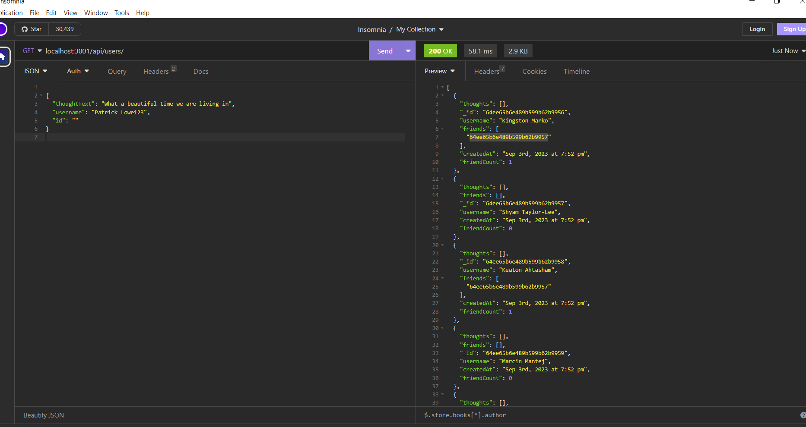

# 

# Book Search Engine

## [Patrick Lowe](https://github.com/PatrickWLowe)

## Description

#### An app that allows to create, update, and delete users and thoughts in a database. As well as add/delete friends and add/delete reactions to other users thoughts.

## Technologies-Used


### Mongoose

### Insomnia

### nodemon

### bcrypt

### GitBash

## Installation

#### If you want to have it locally. you will need to install MongoDB Compass. You will also need to clone the repository and open the folder locally. Then you will need to run "npm install" in the parent folder Terminal. Then you will need to enter in your terminal "npm run seeds" and then "npm start" to get the app running.

## User Story

```md
AS A social media startup
I WANT an API for my social network that uses a NoSQL database
SO THAT my website can handle large amounts of unstructured data
```

## Acceptance Criteria

```md
GIVEN a social network API
WHEN I enter the command to invoke the application
THEN my server is started and the Mongoose models are synced to the MongoDB database
WHEN I open API GET routes in Insomnia for users and thoughts
THEN the data for each of these routes is displayed in a formatted JSON
WHEN I test API POST, PUT, and DELETE routes in Insomnia
THEN I am able to successfully create, update, and delete users and thoughts in my database
WHEN I test API POST and DELETE routes in Insomnia
THEN I am able to successfully create and delete reactions to thoughts and add and remove friends to a user’s friend list
```

## License

### This project is licensed under the MIT License

[MIT](https://opensource.org/licenses/MIT)

## Screenshots of the APP




## Deployed Website

[Video walkthrough of app functionality in Insomnia](https://drive.google.com/file/d/1TwmEzXqs--4Oe1SAeAawftTpcpnQSH8A/view)

## References

### https://developer.mozilla.org/en-US/docs/Learn/Server-side/Express_Nodejs/mongoose
